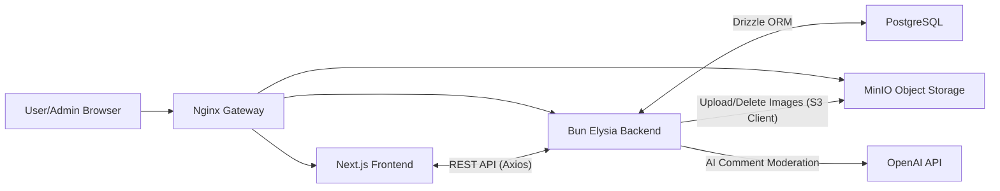

## System Architecture Diagram



## Tech Stack Overview

### Frontend (Client-side & Admin Panel)
* **Next.js (App Router):** Framework สำหรับสร้างหน้า UI ทั้งฝั่งผู้ใช้งานทั่วไปและระบบจัดการ (Admin Panel)
* **Tailwind CSS:** Utility-first CSS framework สำหรับจัดการ Styling และ UI Components
* **Zustand:** จัดการ Global State ภายในแอปพลิเคชัน (เช่น ระบบ Authentication)
* **Tiptap:** Rich Text Editor สำหรับเขียนและจัดรูปแบบเนื้อหาบทความ (WYSIWYG)
* **Axios:** จัดการ HTTP Requests เพื่อเชื่อมต่อกับ Backend API

### Backend (API & Business Logic)
* **Bun:** JavaScript/TypeScript Runtime ที่มีความเร็วสูง ใช้เป็นแกนหลักในการรัน Backend
* **ElysiaJS:** Web Framework ที่ทำงานบน Bun โดดเด่นเรื่องความเร็วและการทำ Type-safety
* **Drizzle ORM:** TypeScript ORM สำหรับจัดการและคิวรีข้อมูลจากฐานข้อมูล
* **Bcrypt & JWT:** จัดการเรื่อง Security, การเข้ารหัสรหัสผ่าน และการยืนยันตัวตนด้วยระบบ Access/Refresh Token
* **Swagger:** เครื่องมือสร้าง API Documentation อัตโนมัติ

### Database & Storage
* **PostgreSQL:** ฐานข้อมูลหลัก (Relational Database) สำหรับเก็บข้อมูล Users, Blogs, และ Comments
* **MinIO:** ระบบ Object Storage (S3-compatible) สำหรับจัดเก็บไฟล์รูปภาพหน้าปกและรูปภาพเพิ่มเติม

### Infrastructure & Deployment
* **Docker & Docker Compose:** Containerization สำหรับจำลองสภาพแวดล้อมและรันระบบทั้งหมดเข้าด้วยกัน
* **Nginx:** ทำหน้าที่เป็น API Gateway และ Reverse Proxy จัดการ Routing

### External Services
* **OpenAI API:** ประยุกต์ใช้ LLM ในการวิเคราะห์และช่วยคัดกรอง (Moderation) ความคิดเห็นของบทความโดยอัตโนมัติ (Approve, Reject, Flagged)

---

## Key Features (ฟีเจอร์หลัก)

- **Public Blog:** หน้ารวมบทความ ค้นหาบทความ แบ่งหน้า (Pagination) และหน้ารายละเอียดบทความพร้อมระบบนับยอดวิว
- **Admin Panel:** ระบบจัดการหลังบ้าน (Protected Route) สำหรับสร้าง แก้ไข ลบ และจัดการสถานะ (Publish/Draft) ของบทความ
- **Rich Text & Image Gallery:** รองรับการจัดรูปแบบข้อความ และอัปโหลดรูปภาพหน้าปก + รูปภาพเพิ่มเติมสูงสุด 6 รูป
- **AI Comment Moderation:** เมื่อผู้ใช้คอมเมนต์ ระบบจะส่งข้อความไปให้ OpenAI วิเคราะห์และแนะนำสถานะเบื้องต้นให้ Admin เพื่อช่วยในการตัดสินใจอนุมัติ (Approve/Reject)
- **API Documentation:** มี Swagger UI สำหรับตรวจสอบและทดสอบ API Endpoint ทั้งหมด

---

## Getting Started (วิธีการติดตั้งและรันโปรเจกต์)

### Prerequisites (สิ่งที่ต้องมี)
- Docker และ Docker Compose

### 1. Clone Repository
```bash
git clone [https://github.com/mrapiiwat/metier-blog.git](https://github.com/mrapiiwat/metier-blog.git)
cd metier-blog
```

### 2. Environment Variables
สร้างไฟล์ `.env` ในโฟลเดอร์ต่างๆ โดยอ้างอิงจาก `.env.example`:
- `docker/.env`
- `backend/.env` (สำหรับเชื่อมต่อ Database, MinIO, JWT Secret และ OpenAI API Key)

### 3. Run with Docker Compose
เข้าไปที่โฟลเดอร์ `docker` และรันคำสั่ง:
```bash
cd docker
docker-compose -f docker-compose.dev.yaml up -d --build
```
ระบบจะทำการ Build และ Start Container ทั้งหมด (Frontend, Backend, PostgreSQL, MinIO, Nginx)

### 4. Access the Application
- **Frontend (หน้าเว็บหลัก):** `http://localhost`
- **Admin Panel:** `http://localhost/admin`
- **API Documentation (Swagger):** `http://localhost/api/docs`
- **MinIO Console:** `http://storage.localhost`
